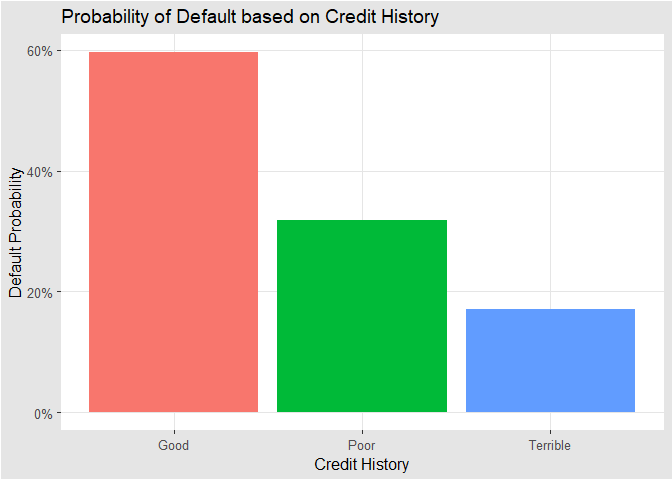

1.) Visualization
-----------------

### Bus Boardings vs Time

-1.png)
The figure above gives us some useful insights into the demand for
Capital Metro’s public bus line at different points in time. Perhaps the
most obvious takeaway is that demand is significantly less on the
weekends than on the weekdays, with Saturday’s and Sunday’s demand being
quite meager compared to that of Monday-Friday. Moreover, peak demand on
Monday through Friday is similar from day to day, having a steady
increase from the morning hours until early evening. This suggests that
the bus line is mostly used by students who have classes in the
afternoon and evening during the week. Furthermore, the growth in
boardings later in the day could suggest that most students stay on
campus until this time, despite when their classes start. Additionally,
there are some interesting trends unique to the monthly data. It would
appear that in September, boardings on Mondays are fewer than any day of
the week. This could be the result of students taking part in
recreational weekend activities since September is early in the semester
and they have less pressure from midterms and final exams. Another trend
is that average boardings in November on Wednesday, Thursday, and Friday
are lower than any other month. This could be the result of late
semester burnout as students may wish to go home earlier to rest later
in the week. Another explanation for these trends are when holidays take
place in these months. September has Labor Day which always falls on a
Monday, and November has Thanksgiving Break which starts on a Wednesday
and goes through Friday.

### Bus Boardings vs Temperature

-1.png)
Our next figure above depicts the relationship between the number of
boardings and temperature. As indicated in the graph, each point
represents the number of boardings in a 15-minute interval, and the
plots are faceted by the hour of the day. Again, we can see that demand
is much greater during the week than on the weekends, consistent with
our first figure. More importantly, we can see that there is no apparent
relationship between temperature and the number of boardings in the day.
Boardings appear to be affected more by the time of the day, not how hot
or cold it is outside.

2.) Saratoga House Prices
-------------------------

There are several ways to build an optimal pricing model, but depending
on the data we are analyzing, some strategies may prove to be better
than others. The analysis below aims to compare the performance of an
optimized linear model to a K-nearest neighbors (KNN) model. This will
be done by separating data from Saratoga housing prices into a training
set for building our model and a testing set for assessing our model’s
out-of-sample performance. We will then build the best linear model we
can and see how it stacks up to KNN.

Lets begin by calculating the out-of-sample, Root Mean Squared Error
(RMSE) for two different linear models. The first will be “built by
hand” as the coefficients will be selected based off arbitrary
assumptions, made by yours truly, of their ability to predict price.
These coefficients will include age of the home, land value, bedrooms,
and bathrooms among others and some interaction effects. The other will
be constructed using the Lasso regression method. Finally, to ensure the
validity of the best performing model, we will loop through this process
30 times and calculate the average RMSE for each.

\*The average RMSE for our ‘hand-build’ model:

    ## [1] 60816.87

\*Cross validated RMSE for Lasso Regression

    ## [1] 52829.65

Now that we have some scores for different builds of linear models, let
us see how these compare to our KNN model.

For our KNN model, we will optimize k and will initiate a similar loop
to determine the average out-of-sample performance of our model.

\*The RMSE for the KNN model:

    ## [1] 64016.16

It would appear that our linear models, particularly our Lasso model
outperforms our KNN model. To optimally predict price, we should build a
linear model using Lasso regularization.

3.) Classification and retrospective sampling
---------------------------------------------

### Ploting probability of default

To begin this analysis, we will take a look at the likelihood that one
will default based solely on their credit history. Particularly, we will
be looking at the probability that one defaults given their history:
 The plot
above suggests that the probability of defaulting goes DOWN with worse
credit history. It does not take much to infer that something is amiss
with our data set.

### Making a predictive model

The red-flags from the plot above may be exaggerated by building a
predictive model. We will begin this process by splitting the data into
a training and testing set. We will then use a logistic model to help us
determine the probability that one will default on their loan.

The coefficients for our logistic model:

    ##         (Intercept)            duration              amount         installment 
    ##       -1.273827e+00        2.454894e-02        7.912923e-05        3.149001e-01 
    ##                 age         historypoor     historyterrible          purposeedu 
    ##       -1.717702e-02       -1.012738e+00       -2.012604e+00        8.404994e-01 
    ## purposegoods/repair       purposenewcar      purposeusedcar       foreigngerman 
    ##        2.623083e-01        9.286465e-01       -4.270398e-01       -7.433400e-01

As seen above, holding all else fixed, the magnitude of the coefficients
do not explicitly tell us the odds that one will default given credit
history. However, the signs suggest that poor and terrible history has
less of a chance of defaulting than good.

These results show that the method for collecting this data is quite
clearly flawed. This data set seems to suggest that those with
‘terrible’ credit history are just as likely to default on a loan as
those with ‘good’ credit history. This does not make any intuitive sense
and is likely the result of improper sampling. Moreover, it dismisses
any predictive power of a logistic model to data outside of this sample.
If the bank tried to build a model using random sampling, they would
likely be able to build a better predictive model regarding rates of
default.

4.) Children and Hotel Reservations
-----------------------------------

#### Baseline 1

Below are the predictions on the testing set. This will be used to
measure out-of-sample performance. We can see that it never predicted
children would be on the itinerary.

    ##       Predictions
    ## Actual    0
    ##      0 8288
    ##      1  712

\*Percentage of out-of-sample correct classifications:

    ## [1] 92.09

#### Baseline 2

Using the same methodology, the second baseline model shows slightly
better results than our previous model:

    ##       Predictions
    ## Actual    0    1
    ##      0 8192   96
    ##      1  448  264

\*Percentage of out-of-sample correct classifications:

    ## [1] 93.96

#### Best linear model

Finally, we see that our best linear model, constructed using Lasso
regression, has similar results to Baseline 2:

    ##       Predictions
    ## Actual    0    1
    ##      0 8183  105
    ##      1  461  251

\*Percentage of out-of-sample correct classifications:

    ## [1] 93.71

### Model Validation: Step 1

We will begin this process by constructing a confusion matrix of Actual
vs Predicted values:

    ##       Predictions
    ## Actual    0    1
    ##      0 4528   69
    ##      1  254  148

\*Percentage of out-of-sample correct classifications:

    ## [1] 93.54

We can see from the results above that our model performed well with the
new data.

To drive this home, we will plot our results on a ROC curve by plotting
the True Positive Rate against the False Positive Rate for different
thresholds of t.

-1.png)

### Model Validation: Step 2

-1.png)

For 20 folds of the data in hotels\_val, the graph above shows the
predicted vs the actual values of the number of families that will have
children with them. We can see that the model used here tends to over
predict the number of children in each fold, but it seems that the
predicted values are quite close to the actual values.
